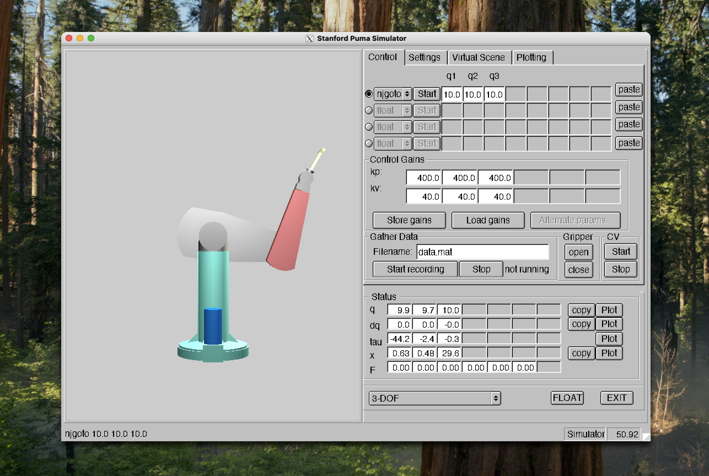

# Puma Simulator for Mac
Steps to run the puma simulator on M* macs.

## Setup
1. Install Docker, XQuartz (graphics forwarding), and Rosetta (x86 translation)
```bash
brew install --cask docker
brew install --cask --no-quarantine xquartz
softwareupdate --install-rosetta

open -a docker # Accept license agreements and finish installation via the GUI
```

2. Run the setup script  
This script configures GL graphics for XQuartz:
```bash
./pumasim_mac_config.zsh
```

3. Build the Docker image:
```bash
docker build --platform=linux/amd64 -t robobuntu:latest .
```

## Running
1. Start XQuartz
```bash
open -a xquartz
```

2. Run pumasim
Here you have an option to share a local directory with the ubuntu container. This way you can edit code locally and run it in the container. Replace `{/local/path}` with your local robotics assignment directory.

This will then run the docker container in interactive mode:
```bash
docker run --privileged --platform=linux/amd64 --rm -v {/local/path}:/robotics -i -t robobuntu bash
```

Then simply:
```bash
cd robotics && ls

# Move to wherever the CMakeLists.txt file is
cd /path/to/CMakeLists.txt

cmake -B build

# Compile
cd build
make

# Run
pumasim
```

You should see the pumasim window natively on your mac desktop 🎉


